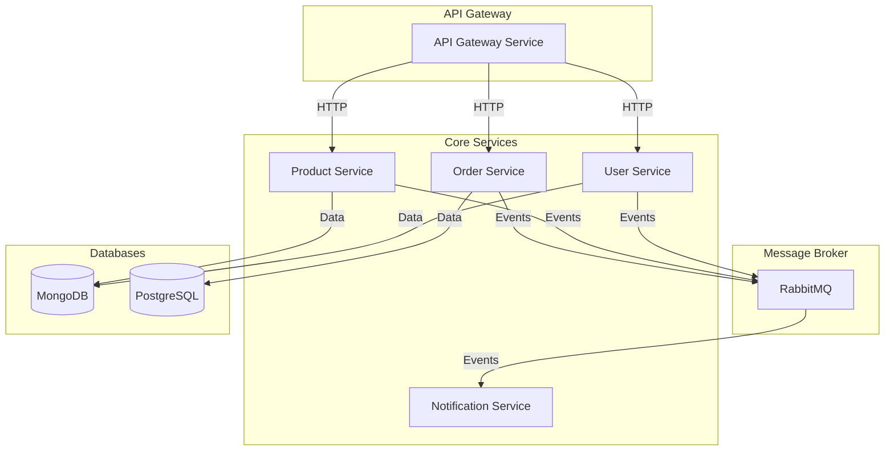
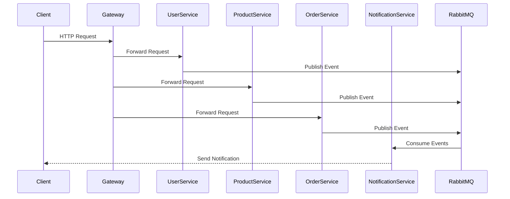

# NestJS Microservices Architecture

This project demonstrates a microservices architecture built with NestJS, featuring multiple services that communicate through message patterns and HTTP.

## Architecture Overview

## Service Communication Flow

