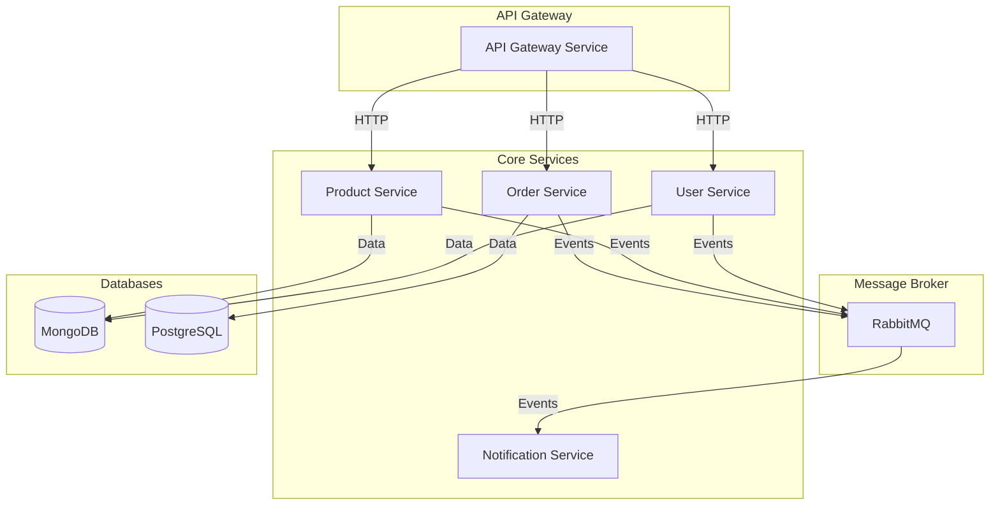
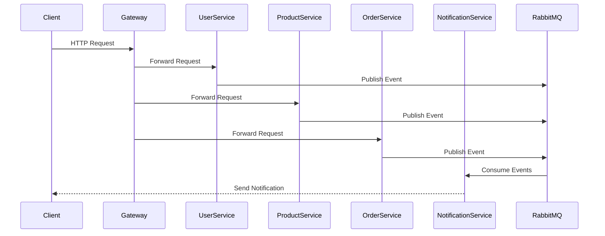

# NestJS Microservices Architecture

This project demonstrates a microservices architecture built with NestJS, featuring multiple services that communicate through message patterns and HTTP.

## Architecture Overview



## Service Communication Flow



## Project Structure

```
├── apps/
│   ├── api-gateway/         # API Gateway Service
│   ├── user-service/        # User Management Service
│   ├── product-service/     # Product Management Service
│   ├── order-service/       # Order Management Service
│   └── notification-service/# Notification Service
├── libs/
│   ├── common/             # Shared utilities and constants
│   └── interfaces/         # Shared interfaces and DTOs
├── docker-compose.yml      # Docker compose configuration
└── package.json           # Root package.json
```

## Prerequisites

- Node.js (v16 or later)
- Docker and Docker Compose
- MongoDB
- PostgreSQL
- RabbitMQ

## Getting Started

1. Clone the repository:
```bash
git clone <repository-url>
cd nestjs-microservices
```

2. Install dependencies:
```bash
npm install
```

3. Start the services using Docker Compose:
```bash
docker-compose up -d
```

4. Start the development servers:
```bash
npm run start:dev
```

## Services

### API Gateway
- Port: 3000
- Handles all incoming HTTP requests
- Routes requests to appropriate microservices
- Implements authentication and authorization

### User Service
- Port: 3001
- Manages user authentication and profiles
- Uses MongoDB for data storage
- Publishes user-related events

### Product Service
- Port: 3002
- Handles product catalog and inventory
- Uses MongoDB for data storage
- Publishes product-related events

### Order Service
- Port: 3003
- Manages order processing and fulfillment
- Uses PostgreSQL for data storage
- Publishes order-related events

### Notification Service
- Port: 3004
- Handles all notifications
- Subscribes to events from other services
- Sends notifications via email, SMS, etc.

## Communication Patterns

1. **Synchronous Communication**
   - HTTP/REST between API Gateway and services
   - Used for direct service-to-service communication

2. **Asynchronous Communication**
   - RabbitMQ for event-driven communication
   - Used for cross-service notifications and updates

## Development

### Adding a New Service

1. Create a new service in the `apps` directory
2. Update the Docker Compose configuration
3. Add service configuration in the API Gateway
4. Update the shared interfaces if needed

### Running Tests

```bash
npm run test
```

## Deployment

The services can be deployed using Docker containers. Each service has its own Dockerfile and is configured in the docker-compose.yml file.

## Contributing

1. Fork the repository
2. Create a feature branch
3. Commit your changes
4. Push to the branch
5. Create a Pull Request

## License

This project is licensed under the MIT License. 